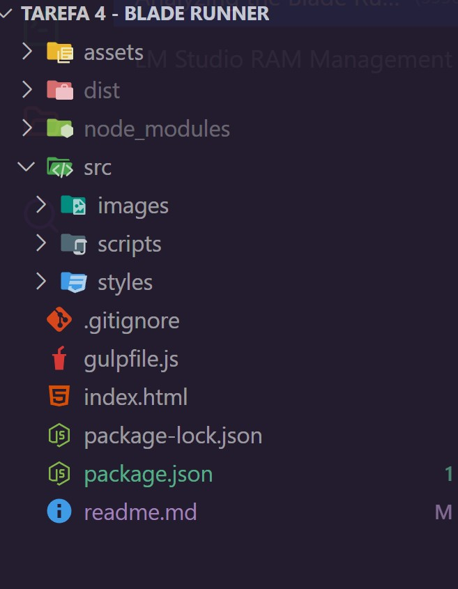
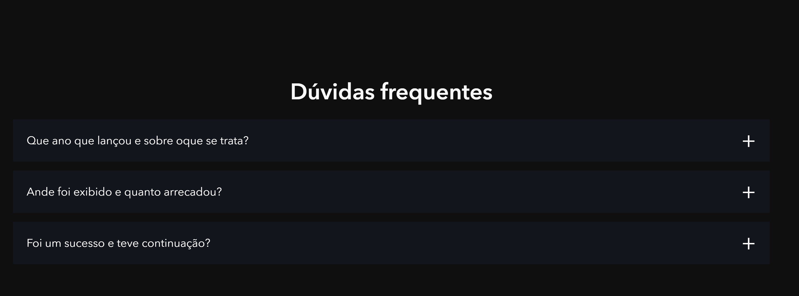
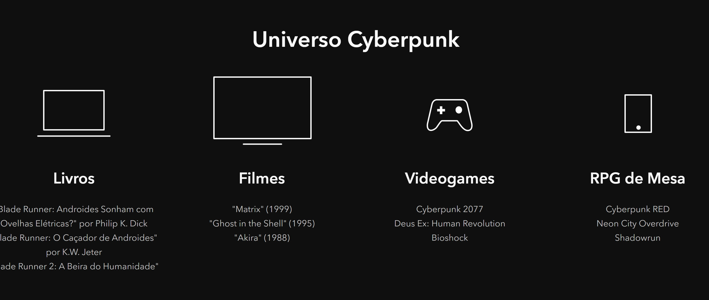

[Projeto publicado na VERCEL](https://blade-runner-gulp-five.vercel.app/?vercelToolbarCode=TTmhaBgrl1eObiQ)

**PROJETO BLADE RUNNER - EBAC**
==========================


==========================

**Sobre o Projeto BLADE RUNNER**
--------------------

Este é um projeto de uma página web inspirada na temática cyberpunk. Utilizamos tecnologias como Sass e Gulp para criar uma estrutura sólida e eficiente.

**Tecnologias Utilizadas**
---------------------------

* **Sass**: Uma linguagem de pre-processamento de CSS que permite criar estilos mais complexos e mantê-los organizados.
* **Gulp**: Um pacote de ferramentas que ajuda a automatizar tarefas como compilação, minificação e otimização de arquivos.
* **HTML**: A linguagem de marcação para estruturar os conteúdos da página web.

**Estrutura do Projeto**
-------------------------



**Imagem de Captura**
---------------------

Aqui está uma imagem de captura do que o projeto busca alcançar:






**Como Funciona**
------------------

O projeto é composto por várias partes interconectadas:

* A estrutura básica da página web é definida pelo arquivo `index.html`.
* As estilos são definidos no arquivo `scss` e compilados para CSS com a ferramenta Gulp.
* As imagens são armazenadas na pasta `assets/images`.

**Uso do Sass**
----------------

O Sass é uma linguagem de pre-processamento de CSS que permite criar estilos mais complexos e mantê-los organizados. Neste projeto, o Sass é utilizado para criar classes personalizadas para as diferentes partes da página web.

Por exemplo:

```scss
.button {
  background-color: #4B2CF8;
  color: #C0C0C0;
  padding: 10px 20px;
  border-radius: 4px;
  text-transform: uppercase;
  border: 1px solid #4B2CF8;
}

.button:hover {
  background-color: lighten(#4B2CF8, 3%);
}
```

**Uso de Gulp**
----------------

O Gulp é uma ferramenta que ajuda a automatizar tarefas como compilação, minificação e otimização de arquivos. Neste projeto, o Gulp é utilizado para compilar o Sass para CSS.

Por exemplo:

```bash
gulp sass:compile
```

Isso compila o arquivo `styles.scss` para um arquivo CSS chamado `styles.css`.
